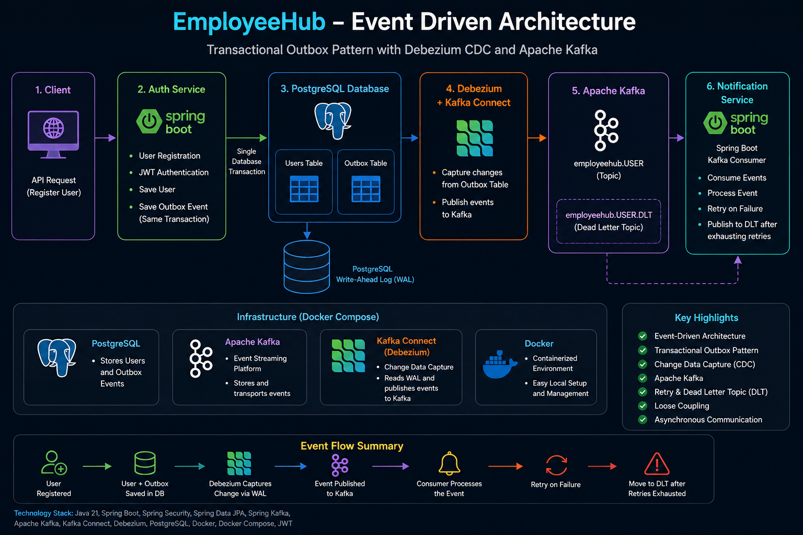
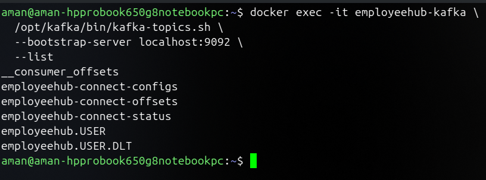
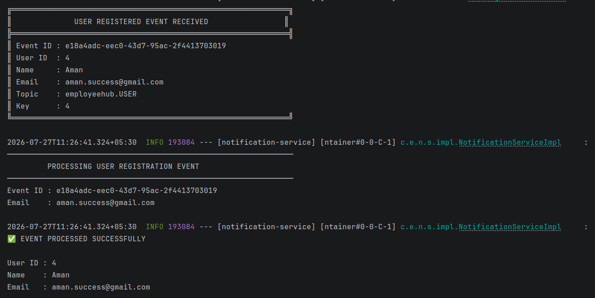
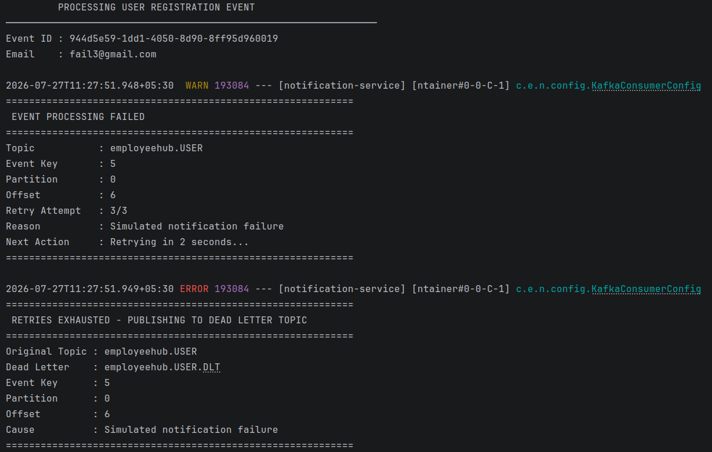

# EmployeeHub

<p align="center">


</p>

A production-inspired Spring Boot microservices project demonstrating **Event-Driven Architecture** using **Apache Kafka**, **Transactional Outbox Pattern**, and **Debezium Change Data Capture (CDC)**.

Instead of publishing Kafka messages directly from the application, business events are stored in an **Outbox table** as part of the same database transaction. **Debezium** monitors PostgreSQL's Write-Ahead Log (WAL) and automatically publishes these events to Kafka, enabling reliable asynchronous communication between microservices.

---

# Architecture

<p align="center">

</p>

---

# Why this project?

Most Kafka tutorials use `KafkaTemplate` directly inside the application.

This project demonstrates a more production-oriented approach where:

- Business data and events are committed atomically using the **Transactional Outbox Pattern**
- **Debezium** publishes events automatically by monitoring PostgreSQL WAL
- Services communicate asynchronously through Kafka without directly producing messages
- Consumers implement retry and Dead Letter Topic (DLT) handling for failed events

---

# Technology Stack

| Category | Technologies |
|-----------|--------------|
| Language | Java 21 |
| Framework | Spring Boot, Spring Security |
| Persistence | Spring Data JPA |
| Messaging | Apache Kafka, Spring Kafka |
| CDC | Debezium, Kafka Connect |
| Database | PostgreSQL |
| Authentication | JWT |
| Infrastructure | Docker, Docker Compose |

---

# Services

## Auth Service

Responsibilities

- User Registration
- User Authentication
- JWT Token Generation
- Password Encryption
- Persist User & Outbox Event in a single transaction

---

## Notification Service

Responsibilities

- Consume `UserRegistered` events
- Process asynchronous events
- Retry failed event processing
- Publish failed events to a Dead Letter Topic (DLT)
- Log successful and failed event processing

> The current implementation focuses on demonstrating reliable event consumption rather than sending actual emails or notifications.

---

# Event Lifecycle

```text
Client
   │
   ▼
Auth Service
   │
   ├── Save User
   ├── Save Outbox Event
   ▼
PostgreSQL
   │
   ▼
Debezium CDC
   │
   ▼
Apache Kafka
   │
   ▼
Notification Service
   │
   ├── Success  → Process Event
   └── Failure
          │
          ├── Retry
          ├── Retry
          ├── Retry
          └── Publish to employeehub.USER.DLT
```

---

# Project Highlights

- Event-Driven Microservices
- Apache Kafka Messaging
- Transactional Outbox Pattern
- Debezium Change Data Capture (CDC)
- Kafka Connect
- JWT Authentication
- Retry Strategy
- Dead Letter Topic (DLT)
- Dockerized Development Environment

---

# Screenshots

## Docker Infrastructure

<p align="center">

</p>

---

## Kafka Topics

<p align="center">

</p>

---

## Successful Event Processing

<p align="center">

</p>

---

## Retry & Dead Letter Topic (DLT)

<p align="center">

</p>

---

# Repository Structure

```text
EmployeeHub
│
├── auth-service
├── notification-service
├── infrastructure
│   ├── docker-compose.yml
│   └── debezium/
├── docs
│   └── screenshots
└── README.md
```

---

# Running the Project

Start the infrastructure

```bash
docker compose up -d
```

Run the services

```bash
# Terminal 1
cd auth-service
./mvnw spring-boot:run

# Terminal 2
cd notification-service
./mvnw spring-boot:run
```

---

# Concepts Demonstrated

- Microservices Architecture
- Event-Driven Architecture
- Transactional Outbox Pattern
- Change Data Capture (CDC)
- Consumer Groups
- Retry Strategy
- Dead Letter Topics (DLT)
- Loose Coupling
- Asynchronous Communication

---

# Learning Objective

The primary goal of this project is to gain hands-on experience with production-grade messaging patterns used in modern distributed systems. It demonstrates how enterprise applications can publish events reliably, process them asynchronously, and recover gracefully from failures using Apache Kafka and Debezium.

---

## Author

**Gurinder Singh**

Software Engineer • Java • Spring Boot • Apache Kafka • Event-Driven Architecture