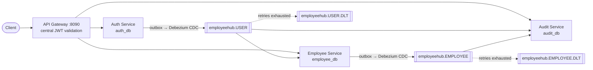
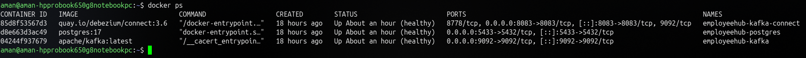

# EmployeeHub

<p align="center">


</p>

> **Event-driven microservices in Spring Boot** — a production-inspired system showing **Apache Kafka**, the **Transactional Outbox pattern**, and **Debezium CDC** working end to end.

### At a glance

| | |
|---|---|
| **What** | 4 Spring Boot microservices communicating via Kafka events |
| **Services** | `api-gateway` · `auth` · `employee` · `audit` |
| **Stack** | Java 21 · Spring Boot 3 · Spring Cloud Gateway · Kafka · Debezium CDC · PostgreSQL · Flyway · Docker |
| **Key patterns** | API Gateway + centralized JWT auth · Transactional Outbox · CDC · Database-per-Service · Event fan-out · Retry + Dead Letter Topic |
| **API reference** | [docs/API.md](docs/API.md) |
| **Run it** | `docker compose -f infrastructure/docker-compose.yml up -d` → `./run.ps1` |

---

# Architecture



The API Gateway is the single entry point and validates the JWT once. `auth`
emits `UserRegistered`, which **fans out** to both `employee` (auto-provisions a
profile) and `audit` (records the event). `employee` then emits its own
`EmployeeCreated` / `EmployeeUpdated` events, which `audit` also records.

---

# Why this project?

Most Kafka tutorials use `KafkaTemplate` directly inside the application.

This project demonstrates a more production-oriented approach where:

- Business data and events are committed atomically using the **Transactional Outbox Pattern**
- **Debezium** publishes events automatically by monitoring PostgreSQL WAL
- Services communicate asynchronously through Kafka without directly producing messages
- Consumers implement retry and Dead Letter Topic (DLT) handling for failed events

---

# Technology Stack

| Category | Technologies |
|-----------|--------------|
| Language | Java 21 |
| Framework | Spring Boot, Spring Security |
| API Gateway | Spring Cloud Gateway |
| Persistence | Spring Data JPA |
| Schema Migrations | Flyway |
| Messaging | Apache Kafka, Spring Kafka |
| CDC | Debezium, Kafka Connect |
| Database | PostgreSQL |
| Authentication | JWT (issued by auth, validated centrally at the gateway) |
| Infrastructure | Docker, Docker Compose |

---

# Services

## Auth Service

Responsibilities

- User Registration
- User Authentication
- JWT Token Generation
- Password Encryption
- Persist User & Outbox Event in a single transaction

Owns the `auth_db` database. Publishes `UserRegistered` to `employeehub.USER`.

---

## Employee Service

Responsibilities

- Consume `UserRegistered` events and **auto-provision** a draft employee profile (`PENDING_ONBOARDING`)
- Expose **REST APIs** (behind the gateway) to view and update employee profiles
- Persist Employee & Outbox Event in a single transaction
- Publish `EmployeeCreated` / `EmployeeUpdated` events to `employeehub.EMPLOYEE`
- Retry failed event consumption and route to a Dead Letter Topic (DLT)

Owns its own `employee_db` database (database-per-service). It is the only
service that is **both a consumer and a producer**, demonstrating that the
Outbox + Debezium pattern is reusable across services and that events chain
between microservices.

> Authentication is handled entirely by the gateway. This service holds no JWT
> secret; it reads the caller's identity from the trusted `X-Auth-User` header.

### Endpoints

| Method | Path | Description |
| --- | --- | --- |
| GET | `/api/v1/employees` | List all employee profiles |
| GET | `/api/v1/employees/{id}` | Get a profile by id |
| GET | `/api/v1/employees/me` | Get the caller's own profile (from JWT) |
| PUT | `/api/v1/employees/{id}` | Complete / update a profile (emits `EmployeeUpdated`) |

---

## Audit Service

Responsibilities

- Consume `UserRegistered` events (`employeehub.USER`)
- Consume `EmployeeCreated` / `EmployeeUpdated` events (`employeehub.EMPLOYEE`)
- Process asynchronous events
- **Persist an immutable audit / event log** (own `audit_db`) and expose it via a REST endpoint
- Retry failed event processing
- Publish failed events to a Dead Letter Topic (DLT)
- Log successful and failed event processing

As the **second consumer** of `employeehub.USER`, it demonstrates event
**fan-out**: a single event is processed independently by both employee-service
and audit-service.

> The audit log is a queryable history of every domain event the system emitted
> - a common real-world microservice (activity feed / compliance trail). The
> focus stays on reliable event consumption.

### Endpoints

| Method | Path | Description |
| --- | --- | --- |
| GET | `/api/v1/audit` | List recorded events (newest first) |

---

# Event Lifecycle

```text
Client
   │
   ▼
Auth Service
   │
   ├── Save User
   ├── Save Outbox Event
   ▼
PostgreSQL (auth_db)
   │
   ▼
Debezium CDC
   │
   ▼
Apache Kafka  ──►  employeehub.USER
   │
   ├──────────────────────────────┐
   ▼                              ▼
Audit Service               Employee Service
(record event)             ├── Save Employee (PENDING_ONBOARDING)
                           ├── Save Outbox Event
                           ▼
                       PostgreSQL (employee_db)
                           │
                           ▼
                       Debezium CDC
                           │
                           ▼
                   Apache Kafka  ──►  employeehub.EMPLOYEE
                           │
                           ▼
                   Audit Service
                   (record event)

Any consumer failure:
   ├── Retry
   ├── Retry
   ├── Retry
   └── Publish to <topic>.DLT   (e.g. employeehub.USER.DLT / employeehub.EMPLOYEE.DLT)
```

The single `UserRegistered` event fans out to **two independent consumer
groups** (audit-service and employee-service), and employee-service then
emits its **own** events — showing event choreography across services.

---

# Project Highlights

- Event-Driven Microservices
- API Gateway (single entry point, Spring Cloud Gateway)
- Centralized Authentication (JWT validated once at the edge)
- Event Choreography (one event, multiple independent consumers)
- A service that is both a Consumer and a Producer (event chaining)
- Database-per-Service (auth_db / employee_db / audit_db) with data duplication via events
- Versioned schema migrations with Flyway (Hibernate set to `validate`)
- Apache Kafka Messaging
- Transactional Outbox Pattern (reused across services)
- Debezium Change Data Capture (CDC)
- Kafka Connect
- JWT Authentication (validated by the gateway, trusted by services)
- Retry Strategy
- Dead Letter Topic (DLT)
- Dockerized Development Environment

---

# Screenshots

## Docker Infrastructure

<p align="center">

</p>

---

## Kafka Topics

```text
employeehub.USER            employeehub.USER.DLT
employeehub.EMPLOYEE        employeehub.EMPLOYEE.DLT
```

---

## Event Processing (audit-service logs)

Successful consumption:

```text
USER REGISTERED EVENT RECEIVED (audit)
Topic : employeehub.USER
✅ AUDIT RECORDED: UserRegistered for asha@example.com
```

Retry then Dead Letter Topic (event whose email contains "fail"):

```text
EVENT PROCESSING FAILED   Retry Attempt 1/3   Retrying in 2 seconds...
EVENT PROCESSING FAILED   Retry Attempt 2/3   Retrying in 2 seconds...
RETRIES EXHAUSTED - PUBLISHING TO DEAD LETTER TOPIC
Original Topic : employeehub.USER   Dead Letter : employeehub.USER.DLT
```

---

# Repository Structure

```text
EmployeeHub
│
├── api-gateway
├── auth-service
├── employee-service
├── audit-service
├── infrastructure
│   ├── docker-compose.yml
│   ├── init-db/                         # creates employee_db + audit_db on first init
│   ├── debezium-postgres-connector.json # auth_db  outbox connector
│   └── debezium-employee-connector.json # employee_db outbox connector
├── docs
│   └── screenshots
└── README.md
```

---

# Running the Project

The whole system comes up with **two commands**.

### 1. Start the infrastructure

```bash
docker compose -f infrastructure/docker-compose.yml up -d
```

This starts PostgreSQL, Kafka and Kafka Connect (Debezium). All three
databases are created automatically:

- `auth_db` via the container's `POSTGRES_DB`
- `employee_db` and `audit_db` via the Postgres init scripts in
  `infrastructure/init-db` (mounted into `/docker-entrypoint-initdb.d`)

No manual database setup is needed.

> **Schema:** each service owns its tables as versioned **Flyway** migrations
> under `src/main/resources/db/migration`. On startup Flyway applies them, and
> Hibernate is set to `validate` (it never modifies the schema — it only checks
> that the entities match the migrated tables).

### 2. Run all services

```powershell
./run.ps1
```

`run.ps1` launches all four services (each in its own window with live logs),
points `JAVA_HOME` at JDK 21, and then **registers the Debezium outbox
connectors automatically** once the owning services are healthy (the connectors
are registered here, not in Docker, because each one needs its service's
`outbox_events` table to exist first). Registration is idempotent — re-running
the script simply skips connectors that already exist.

> **Already had a Postgres volume from an earlier version?** The init scripts
> only run on a *fresh* volume, and older data may contain tables created before
> Flyway was introduced (which Flyway would refuse to migrate over). Reset it
> once with:
> ```bash
> docker compose -f infrastructure/docker-compose.yml down -v
> docker compose -f infrastructure/docker-compose.yml up -d
> ```
> (This wipes local data.) Alternatively create the two databases by hand once:
> ```bash
> docker exec -it employeehub-postgres psql -U postgres -c "CREATE DATABASE employee_db;"
> docker exec -it employeehub-postgres psql -U postgres -c "CREATE DATABASE audit_db;"
> ```

Each window ends with a clear banner showing where the service is running:

```
==============================================================
   AUTH-SERVICE is UP and running
--------------------------------------------------------------
   Local     : http://localhost:8080
   Actuator  : http://localhost:8080/actuator
==============================================================
```

> PowerShell 7+ runs on macOS and Linux too, so the same script works there.

### Health checks

| Service | Health URL |
| --- | --- |
| api-gateway | http://localhost:8090/actuator/health |
| auth-service | http://localhost:8080/api/v1/health |
| auth-service (actuator) | http://localhost:8080/actuator/health |
| employee-service | http://localhost:8082/api/v1/health |
| employee-service (actuator) | http://localhost:8082/actuator/health |
| audit-service | http://localhost:8081/actuator/health |

> **Clients should talk to the gateway on `:8090`.** For example, register via
> `POST http://localhost:8090/api/v1/auth/register`, then call
> `GET http://localhost:8090/api/v1/employees` (the gateway validates the JWT
> and forwards your identity). The service ports above are for health checks and
> local debugging; in production only the gateway would be exposed.

### Stopping

- Close a service's window (or press **Ctrl+C** in it) to stop that service.
- Stop the infrastructure when you're done:

```bash
docker compose -f infrastructure/docker-compose.yml down
```

### Run services manually (optional)

```bash
# Terminal 1
cd api-gateway
./mvnw spring-boot:run

# Terminal 2
cd auth-service
./mvnw spring-boot:run

# Terminal 3
cd employee-service
./mvnw spring-boot:run

# Terminal 4
cd audit-service
./mvnw spring-boot:run
```

---

# Concepts Demonstrated

- Microservices Architecture
- API Gateway & Centralized Authentication
- Database-per-Service
- Versioned Schema Migrations (Flyway)
- Event-Driven Architecture
- Event Choreography & Fan-out
- Transactional Outbox Pattern
- Change Data Capture (CDC)
- Consumer Groups
- Retry Strategy
- Dead Letter Topics (DLT)
- Loose Coupling
- Data Duplication via Events
- Asynchronous Communication

---

# Learning Objective

The primary goal of this project is to gain hands-on experience with production-grade messaging patterns used in modern distributed systems. It demonstrates how enterprise applications can publish events reliably, process them asynchronously, and recover gracefully from failures using Apache Kafka and Debezium.

---

# License

Released under the [MIT License](LICENSE).

---

## Author

**Gurinder Singh**

Software Engineer • Java • Spring Boot • Apache Kafka • Event-Driven Architecture